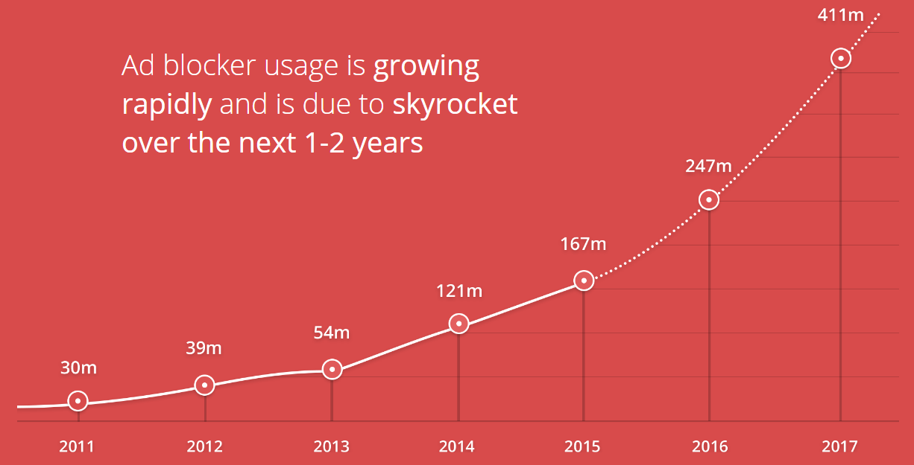
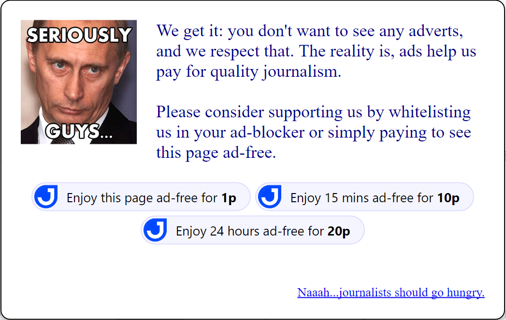

# adblock-relief
Monetise your ad-block users by allowing them to pay you with micropayments.

If you're a content producer, you are by now well aware of the rise in use of ad-blocking across the Internet, especially amongst millennials.  Depending on your country and target audience, you could be seeing **over 60% of your readers using ad-blockers**.  Making matters worse, the Opera browser now comes with ad-blocking enabled by default and who knows how long until Firefox follows suit.



Trying to thwart the ad-blockers is a battle where everyone loses.

Instead, why not have an open dialog with your readers.  Most people running ad-blockers do so not because they're bad people, but because they feel that ads destroy their internet experience.  Indeed, some newspapers have 2Mb+ of ad content (not even counting videos) for just 2kb of news.  How about instead asking your readers to contribute towards funding your journalism with a frictionless micropayments solution - [Jamatto.com](https://jamatto.com).  It could look something like this:



**You can be up and running on your newspaper, magazine or website in less than 2 minutes**.  You can see an example of it in action [here](https://jamatto.com/sample/adblocker).


## Your two-minute installation guide

### Install the adblock-relief files
* Download the `/adblockrelief` directory and place it in the root of your web server with a **random name** (e.g. 'abr12345qwerty' - the random name is important because the ad-blockers may block the word 'adblockrelief').
* Download the `/adblockrelieftemplate` directory and place it in the root of your web server with a **random name** (e.g. 'adblockrelieftemplate').

### Enable adblock-relief on your web server
Add the following lines to the end of your web page `<body>`.
```html
<script>
    document["ABR_TEMPLATE"] = "/adblockrelieftemplate"; // Point to where your donation template is.
</script>
<script src="/abr12345qwerty/ads/ads.js" type="text/javascript"></script>
<script src="/abr12345qwerty/app.js" type="text/javascript"></script>
```

### And you're done!
Your readers with an ad-blocker installed will be presented with a message that offers for them to pay you a small contribution for your content.

## Customising your experience
You know your readers best, so it is probably worth your while to modify the contents of `/adblockrelieftemplate`  to be in line with your website's style and personality.  It is simple HTML, so get your designers to jump in.  It will use the same CSS file as the parent page you are monetising.

At the same time, you can alter the lines in the template `index.html` with your preferences: like currency, price and messaging.  The meaning of each attribute is explained [here](https://jamatto.com/#/BusinessCode).
```html
<i class="jamatto-purchase" ... jamatto-ccy="GBP" jamatto-amount="0.01" ... ></i>
```
NB: to receive your payouts you will have to replace the `jamatto-bid="XXX"` attributes with your own Business ID that you can get from your [Jamatto Seller's Dashboard](https://jamatto.com/#/Seller).

## Why engage with people running ad-blockers?
Ad-blocker traffic is some of the most valuable you never knew you had:
* They are educated, higher earners with significant buying power and disposable income.
* They are high-frequency consumers of digital content and spend a lot of time pursuing interests they are passionate about.
* They are early adopters and highly receptive towards trying products and services they discover.
* They are accustomed to shopping online and regularly make purchases from digital commerce sites.
* They are very active on social media sites and regularly share content with their peer groups.

## I had this running, but it seems to have stopped working...
Occasionally, the ad-blockers may whitelist the files used to detect if an ad-blocker is running.  You need to just change the folder name (i.e. 'abr12345qwerty') to another random name (e.g. 'relief123abc').  Don't forget to update the two script lines that include the adblockrelief code in your HTML.
```html
<script src="/relief123abc/ads/ads.js" type="text/javascript"></script>
<script src="/relief123abc/app.js" type="text/javascript"></script>
```
