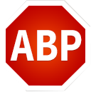

#How to whitelist a site in your adblocker
To disable your ad blocker for the website you are currently visiting, follow the instructions below. Instructions will vary depending on which ad-blocking device you have installed.  Also please take care that if you are running multiple adblockers, you will need to whitelist the site in each of them.

|||
|---|---|
||AdBlock - Click on the warning icon on the top-right-hand corner of your browser window. Click on 'Enabled on this site' to show 'Disabled on this site'.  **NB:** Please ensure you are running the latest version of AdBlock because older versions have a bug where the whitelist is sometimes ignored.|
||Adblock Plus - Click on the ABP icon on the top-right-hand corner of your browser window and select 'Don't run on this page'|
||Ghostery - Click on the ghost icon on the top-right-hand corner of your browser window and select 'Trust site'|
||Adguard AdBlocker - Click on the shield icon on the top-right-hand corner of your browser window and select 'Pause AdGuard protection'|
||Block Origin - Click on the shield icon on the top-right-hand corner of your browser window and click on the large stop icon. When the stop icon is grey, the adblocker is disabled for the site.|
